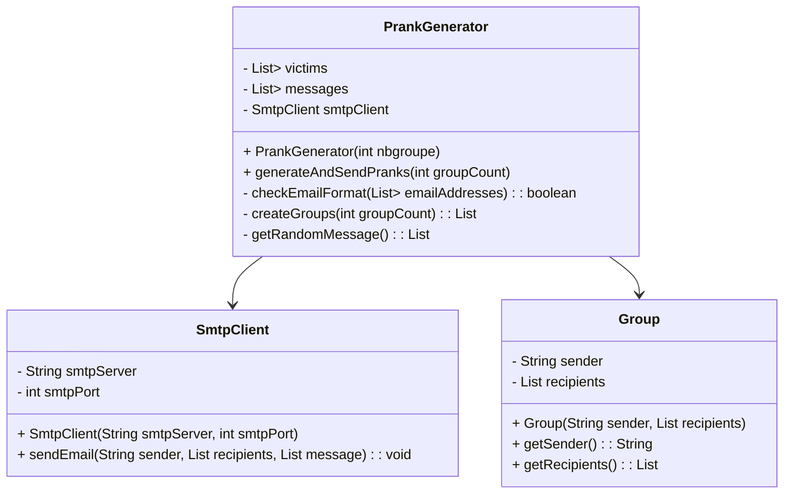
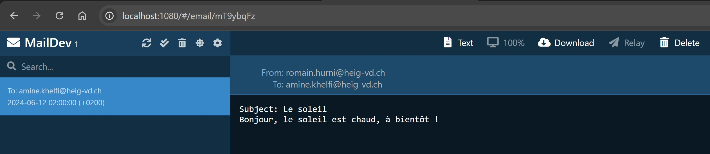

DAI lab: SMTP
=============

Description du projet
----------

Ce projet consiste à développer une application cliente TCP en Java qui utilise l'API Socket pour communiquer avec un serveur SMTP. L'application envoie automatiquement des farces par e-mail à une liste de victimes. Le but est de se familiariser avec le protocole SMTP et de concevoir un modèle orienté objet simple pour répondre aux exigences fonctionnelles.

Configuration du Serveur SMTP Fictif
-----------------------

Pour tester notre application sans envoyer de vrais e-mails, nous pouvons utiliser MailDev comme serveur SMTP fictif. Voici comment le configurer :

 - Docker doit être installé sur la machine
 - Démarrer MailDev 
 
-> Utilisez la commande suivante pour démarrer MailDev :

    docker run -d -p 1080:1080 -p 1025:1025 maildev/maildev

Cela fournira une interface Web sur localhost:1080 et un serveur SMTP sur localhost:1025.

Configuration et Exécution de l'Outil
-----------

**1. Cloner le dépôt : Clonez le dépôt GitHub contenant le code source de l'application.**

        git clone <URL_DU_DEPOT> 
        cd <NOM_DU_DEPOT>
**2. Configurer les fichiers : Modifiez les fichiers de configuration pour inclure vos adresses e-mail et messages.**

`files/email.json` : Contient la liste des adresses e-mail.

`files/fishing_messages.json` : Contient les messages électroniques (objet et corps).

**3. Compiler et exécuter le programme :**

       javac -d bin src/org/example/*.java
       java -cp bin org.example.Main <nombre_de_groupes>

Description de l'Implémentation
-------

### Diagramme de Classes :

**Classes Principales**

`PrankGenerator` : Cette classe est responsable de la génération et de l'envoi des farces. Elle lit les fichiers de configuration, valide les adresses e-mail, crée les groupes et envoie les e-mails.

`SmtpClient` : Cette classe gère la communication avec le serveur SMTP en utilisant des sockets. Elle envoie les e-mails en suivant le protocole SMTP.

`Group` : Cette classe représente un groupe de victimes avec un expéditeur, des destinataires et un message.

### Exemple de Dialogue entre le Client et le Serveur SMTP :

Voici un exemple de dialogue entre le client et le serveur SMTP lors de l'envoi d'un e-mail (avec un seul destinataire) :

    serveur : 220 165026cd7919 ESMTP
    client  : ehlo localhost
    serveur : 250-165026cd7919 Nice to meet you, [172.17.0.1]
    serveur : 250-PIPELINING
    serveur : 250-8BITMIME
    serveur : 250 SMTPUTF8
    client  : mail from: <romain.hurni@heig-vd.ch>
    serveur : 250 Accepted
    client  : rcpt to: <amine.khelfi@heig-vd.ch>
    serveur : 250 Accepted
    client  : data
    serveur : 354 End data with <CR><LF>.<CR><LF>
    client  : From: <romain.hurni@heig-vd.ch>
    client  : To: <amine.khelfi@heig-vd.ch>
    client  : Date: 06.12.2024
    client  : Content-Type: text/plain; charset=UTF-8
    client  : Subject: Le soleil
    client  : Bonjour, le soleil est chaud, à bientôt !
    client  : .
    serveur : 250 Message queued as 2AGvUZYF
    client  : quit
    serveur : 221 Bye

>Note : 
> 
>Chaque envoys du client est termineé par un `\n` et pour quitter le message, le client doit envoyé `\r\n . \r\n `.
>
>Pour que les caractères spéciaux soient pris en compte, il faut ajouter `Content-Type: text/plain; charset=UTF-8\r\n`.

**Résultat :**

